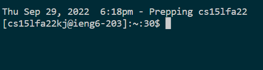

Hello everyone welcome to my beginner's tutorial on how to log into a course-specific account on ieng6. 

 

## VSCode

First, we must install VSCode to gain access to the terminal and modify your files. First, to https://code.visualstudio.com/download

Click on the download button whichever OS you are using, and follow the directions.

Once installed, open it and it should look something like this: 

## Remotely Connecting

Next, we will attempt to ssh into the ieng6 machine.

On Windows, to make sure OpenSSH is installed, open settings, apps, and then optional features. If OpenSSH doesn't come up in the search bar, select Add a feature, then install OpenSSH Client (not server!)
 

Next, in the VSCode terminal (or in your own temrinal), type **ssh [your account name]@ieng6.ucsd.edu**
 
Click yes if prompted to continue,
enter your password, and then you should be logged in. The terminal prompt should now look something like this:

## Trying Some Commands

From here, you can try some terminal commands to test out your remote server. Some commands to consider trying are:
 

**ls**, which lists out all the files in the current directory
 

**cd [folder]**, which changes your workind directory to folder. You can go up a directory by typing in **cd ..**
 

**pwd**, which prints out what directory you are in
 

**cat [file]**, which prints out the contents of file,
 

and **help**, which prints out a large list of commands and their parameters
 

When you wish to terminate the connection, type in **exit**

## Moving Files with scp

## Setting an SSH key

## Optimizing Remote Running