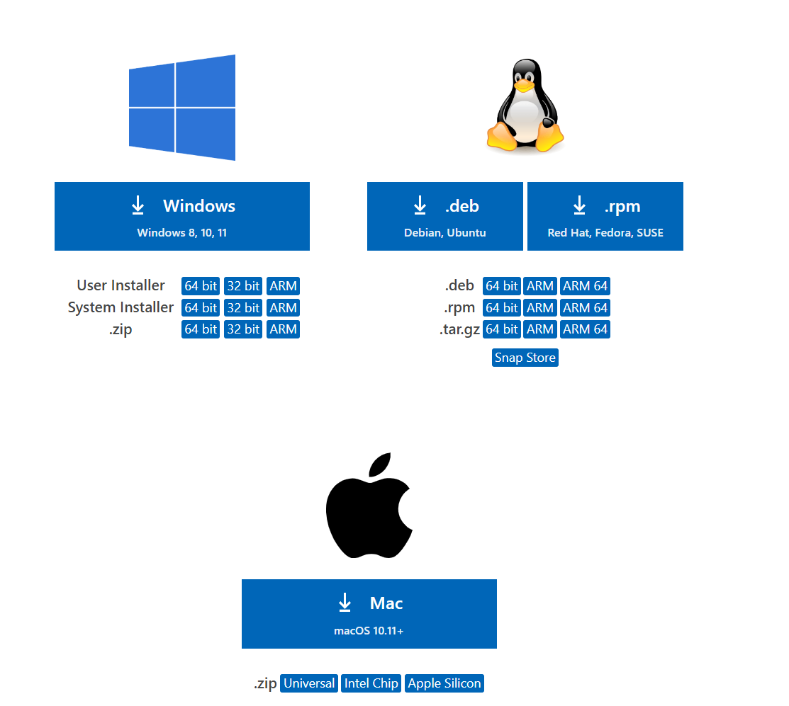
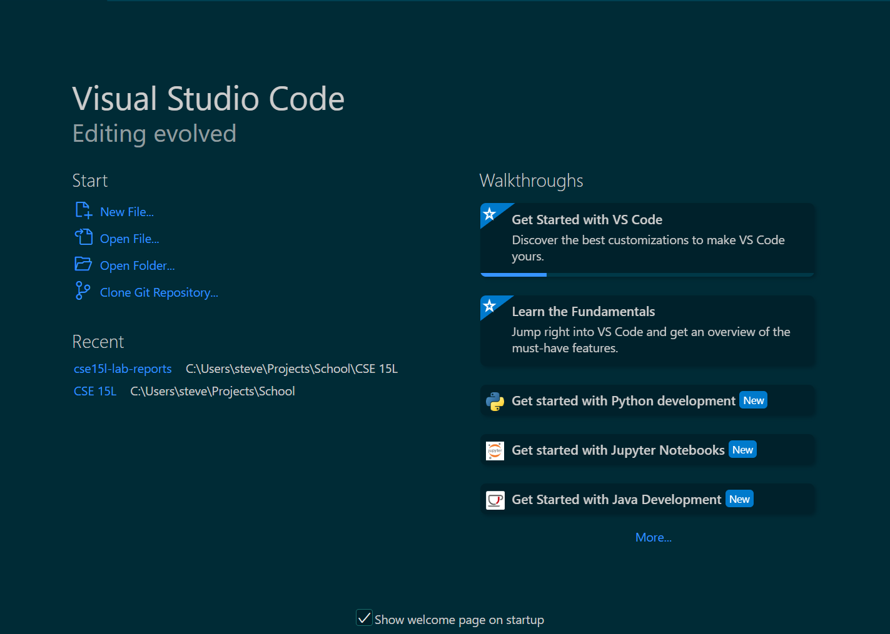

Hello everyone welcome to my beginner's tutorial on how to log into a course-specific account on ieng6. 

 

First, we must install VSCode to gain access to the terminal and modify your files. First, to https://code.visualstudio.com/download

Click on the download button whichever OS you are using, and follow the directions.

Once installed, open it and it should look something like this: 

