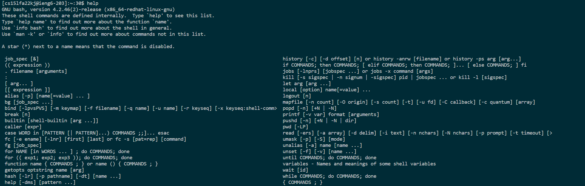
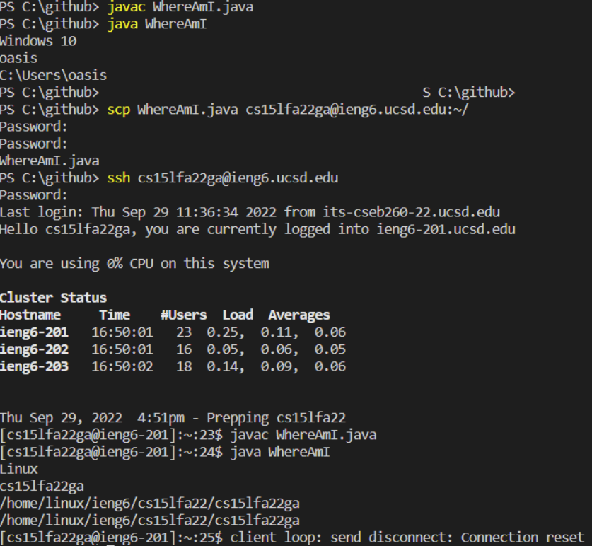
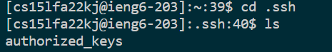
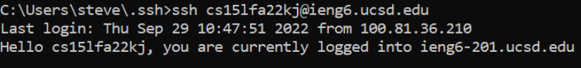
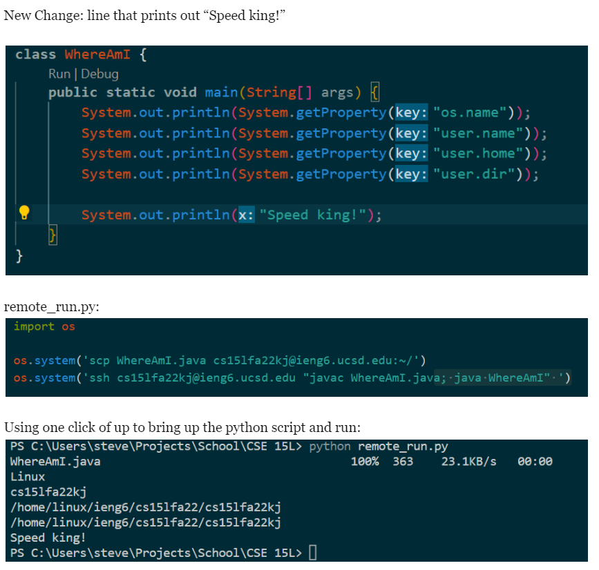

Hello everyone welcome to my beginner's tutorial on how to log into a course-specific account on ieng6. 

 

## VSCode

First, we must install VSCode to gain access to the terminal and modify your files. First, to https://code.visualstudio.com/download

Click on the download button whichever OS you are using, and follow the directions.

Once installed, open it and it should look something like this: 

## Remotely Connecting

Next, we will attempt to ssh into the ieng6 machine.

On Windows, to make sure OpenSSH is installed, open settings, apps, and then optional features. If OpenSSH doesn't come up in the search bar, select Add a feature, then install OpenSSH Client (not server!)
 

Next, in the VSCode terminal (or in your own temrinal), type **ssh [your account name]@ieng6.ucsd.edu**
 
Click yes if prompted to continue,
enter your password, and then you should be logged in. The terminal prompt should now look something like this:

## Trying Some Commands

From here, you can try some terminal commands to test out your remote server. Some commands to consider trying are:
 

**ls**, which lists out all the files in the current directory
 

**cd [folder]**, which changes your workind directory to folder. You can go up a directory by typing in **cd ..**
 

**pwd**, which prints out what directory you are in
 

**cat [file]**, which prints out the contents of file,
 

and **help**, which prints out a large list of commands and their parameters
 
Here is what the output for help looks like:

When you wish to terminate the connection, type in **exit**

## Moving Files with scp
Sometimes, you will want to copy a file from your local machine to the remote machine. You can achieve this with the scp command. 

scp can be used as such: **scp [file] [your username]@ieng6.ucsd.edu:[path]**, where file is the file you want to copy, your username is your username, and path is the path of the directory you want to copy file to.

Here is what a successful scp looks like, the WhereAmI.java file here is being copied to the remote machine

## Setting an SSH key
After you have used ssh for a while, you will get tired of having to type your password when ssh'ing or scp'ing into a server. To get around this, we can generate a pair of public and private keys to verify our identity.

Type in **ssh-keygen** into the terminal, press enter when prompted for the file to save the key, press enter again to specify no passphrase, press enter again, and you will be given a key fingerprint, and a key randomart. 

Then, log back onto the server and make a new directory called .ssh by typing in **mkdir .ssh**

Next, use **scp** to copy the public key **id_rsa.pub** located in the .ssh folder created by the keygen command into the **~/.ssh/authorized_keys** folder. If you don't know how to do this, review the section on scp. 

Here is what the remote .ssh directory should look like after:

Here is what a ssh keygen login looks like, note the lack of a password:

## Optimizing Remote Running
After you have used ssh for a even bigger while, you will get tired of having to type in commands at all.

We can take advantage of the fact that pressing the up key runs previous commands, putting commands in quotes after the ssh command will run those commands in the remote machine, and that separating commands with semicolons lets you run multiple commands.

With this in mind, one thing you can do is write a python script with the following code:

    import os

    os.system('scp WhereAmI.java cs15lfa22kj@ieng6.ucsd.edu:~/')
    os.system('ssh cs15lfa22kj@ieng6.ucsd.edu "javac WhereAmI.java; java WhereAmI" ')

Replacing WhereAmI with whatever file you want to copy over.
Then, run the script with **python run_remove.py** to save the command.

Now, when you want to copy over and run a file on the server, simply press up and enter. 

Below, you can see the run_remove script in action: 

Of course, you will need python installed for this to work. However, that is beyond the scope of this tutorial.

Alternatively, you may abuse the semicolon trick and run this command instead:
**scp WhereAmI.java cs15lfa22kj@ieng6.ucsd.edu:~/; ssh cs15lfa22kj@ieng6.ucsd.edu "javac WhereAmI.java; java WhereAmI"**

And then press up and enter whenever you wish to update and run your code on the server. 