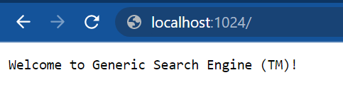
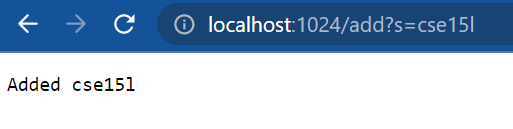
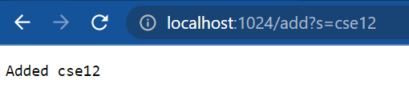
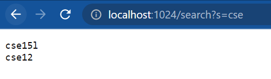

## Here is my code of the simple version of the search engine from week 2

```java
import java.io.IOException;
import java.net.URI;
import java.util.*;

class SearchHandler implements URLHandler {
    
    ArrayList<String> words = new ArrayList<>();

    public String handleRequest(URI url) {
        String path = url.getPath();
        if(path.contains("/add")) {
            String[] parameters = url.getQuery().split("=");
            if(parameters[0].equals("s")) {
                words.add(parameters[1]);
                return "Added " + parameters[1];
            }
        }
        else if(path.contains("/search")) {
            String toRet = "";
            String[] parameters = url.getQuery().split("=");
            if(parameters[0].equals("s")) {
                String key = parameters[1];
                for(String word : words) {
                    if(word.contains(key)) {
                        toRet += (word + "\n");
                    }
                }
            }
            return toRet;
        }

        return "Welcome to Generic Search Engine (TM)!";
    }
}

public class SearchEngine {
    public static void main(String[] args) throws IOException {
        if(args.length == 0){
            System.out.println("Missing port number! Try any number between 1024 to 49151");
            return;
        }

        int port = Integer.parseInt(args[0]);

        Server.start(port, new SearchHandler());
    }
}
```

## Here is a preview of the search engine in action



Here, the main function has just started the server, passing in a SearchHandler. Thus, the handleRequest function is called, and since no queries were made, the default message is dislpayed.



Let's add a word to our dictionary. Again, the handleQuest function is called, this time with an add query where the s field is cse15l. This word is added to the words field in the SearchHandler class, and the message "Added cse15l" is displayed.



Now, cse12 is added via the same method. The words field now contains cse15l and cse12.



Finally, we will query for cse using a search query, the s field being set to cse. Both of the words we have added, which contain the string "cse", are displayed.

## Next, we will explore some poorly written code and use tests to break said code

First we will explore the reverse in place method. This method can easily be broken by using a standard test case like so:

```java
 @Test
  public void testReverseInPlace2() {
    int[] input = { 1, 2, 3 };
    int[] expected = { 3, 2, 1 };
    ArrayExamples.reverseInPlace(input);
    assertArrayEquals(expected, input);
  }
```
And here is the symptom, as shown by the JUnit output:

    JUnit version 4.13.2
    .E......
    Time: 0.009
    There was 1 failure:
    1) testReverseInPlace2(ArrayTests)
    arrays first differed at element [2]; expected:<1> but was:<3>
            at org.junit.internal.ComparisonCriteria.arrayEquals(ComparisonCriteria.java:78)
            at org.junit.internal.ComparisonCriteria.arrayEquals(ComparisonCriteria.java:28)
            at org.junit.Assert.internalArrayEquals(Assert.java:534)
            at org.junit.Assert.assertArrayEquals(Assert.java:418)
            at org.junit.Assert.assertArrayEquals(Assert.java:429)
            at ArrayTests.testReverseInPlace2(ArrayTests.java:24)
            ... 32 trimmed
    Caused by: java.lang.AssertionError: expected:<1> but was:<3>
            at org.junit.Assert.fail(Assert.java:89)
            at org.junit.Assert.failNotEquals(Assert.java:835)
            at org.junit.Assert.assertEquals(Assert.java:120)
            at org.junit.Assert.assertEquals(Assert.java:146)
            at org.junit.internal.ExactComparisonCriteria.assertElementsEqual(ExactComparisonCriteria.java:8)
            at org.junit.internal.ComparisonCriteria.arrayEquals(ComparisonCriteria.java:76)
            ... 38 more
    
    FAILURES!!!
    Tests run: 7,  Failures: 1

As it turns out, the buggy implementation overwrites the first half of the elements, and thus can't reverse the second half of the elements. As a result, instead of giving 3 2 1 as expected, 3 2 3 is returned, as shown in the symptom.

This is evident in line 3 of the buggy code:
```java
  static void reverseInPlace(int[] arr) {
    for(int i = 0; i < arr.length; i += 1) {
      arr[i] = arr[arr.length - i - 1];
    }
  }
```

We can fix this by swapping the elements instead:

```java
  static void reverseInPlace(int[] arr) {
    for(int i = 0; i < arr.length / 2; i += 1) {
      int temp = arr[i];
      arr[i] = arr[arr.length - i - 1];
      arr[arr.length - i - 1] = temp;
    }
  }
```

<br>

The second buggy implementation we will explore is the implementation of filter in the ListExamples file.

Here is the error-inducing input, note the custom checker class that was written, which filters for if a string contains the letter b.

```java
class MyChecker implements StringChecker {
    public boolean checkString(String s) {
      return s.contains("b");
    }
}
```
```java
@Test
public void testFilter() {
    List<String> input = new ArrayList<>();
    input.add("foo");
    input.add("bar");
    input.add("baz");

    StringChecker sc = new MyChecker();

    List<String> expected = new ArrayList<>();
    expected.add("bar");
    expected.add("baz");

    assertEquals(expected, ListExamples.filter(input, sc));
}
```

Here is the symptom, shown again, by the JUnit output:

    JUnit version 4.13.2
    ..E
    Time: 0.006
    There was 1 failure:
    1) testFilter(ListTests)
    java.lang.AssertionError: expected:<[bar, baz]> but was:<[baz, bar]>
            at org.junit.Assert.fail(Assert.java:89)
            at org.junit.Assert.failNotEquals(Assert.java:835)
            at org.junit.Assert.assertEquals(Assert.java:120)
            at org.junit.Assert.assertEquals(Assert.java:146)
            at ListTests.testFilter(ListTests.java:28)
    
    FAILURES!!!
    Tests run: 2,  Failures: 1

Evidently, instead of preserving the order of the strings that made it past the filter, the order was reversed.

The cause of this bug is simple to fix. In the buggy implementation, the added items are inserted at the first index, which causes the final order to be reversed.

```java
static List<String> filter(List<String> list, StringChecker sc) {
    List<String> result = new ArrayList<>();
    for(String s: list) {
      if(sc.checkString(s)) {
        //the error causing line
        result.add(0, s);
      }
    }
    return result;
  }
```

We can fix this by simply changing the insertion to an add that adds the element at the end:

```java
static List<String> filter(List<String> list, StringChecker sc) {
    List<String> result = new ArrayList<>();
    for(String s: list) {
      if(sc.checkString(s)) {
        //the fix
        result.add(s);
      }
    }
    return result;
  }

```