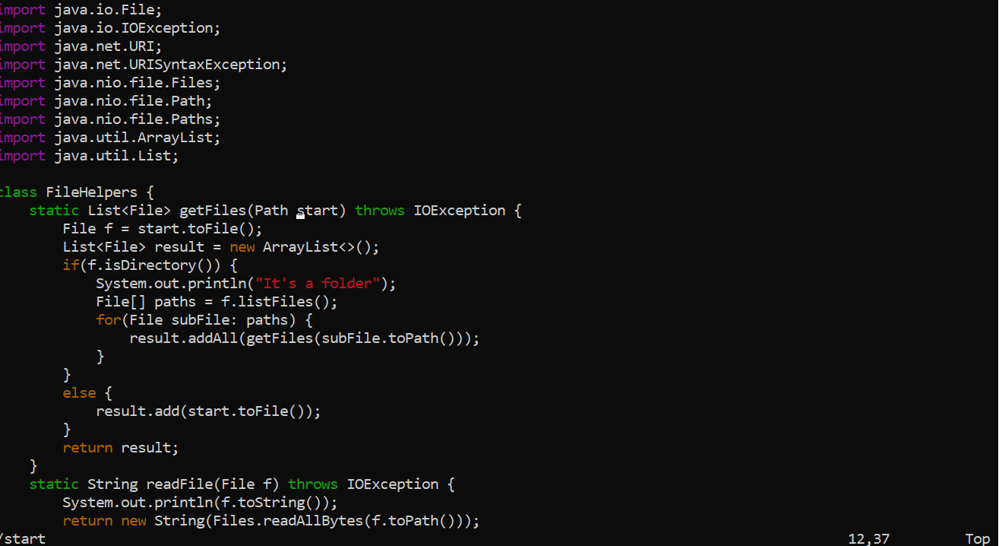
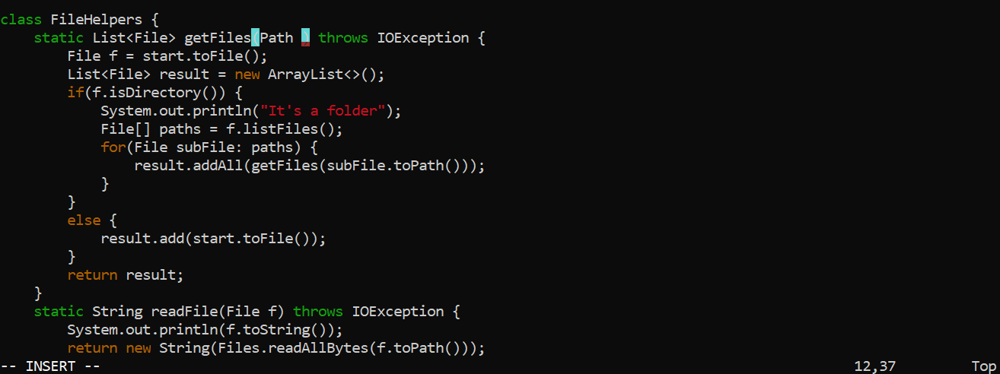
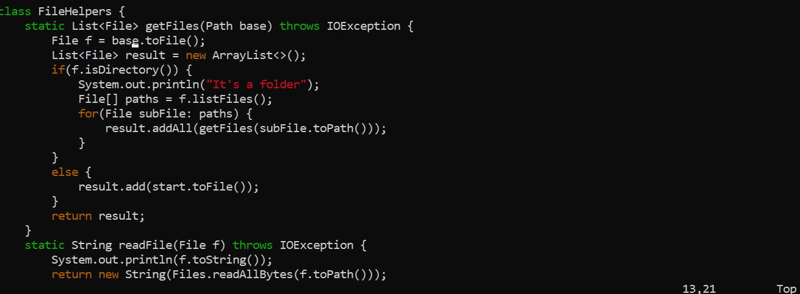
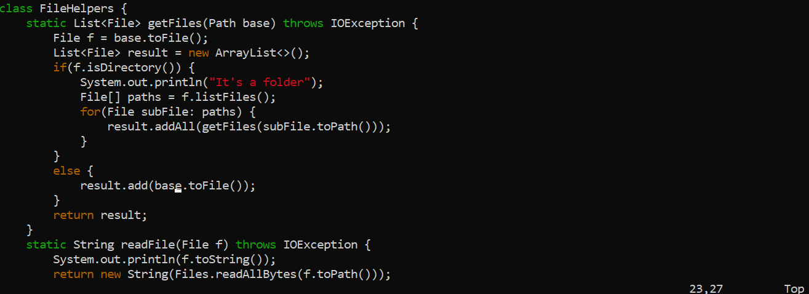
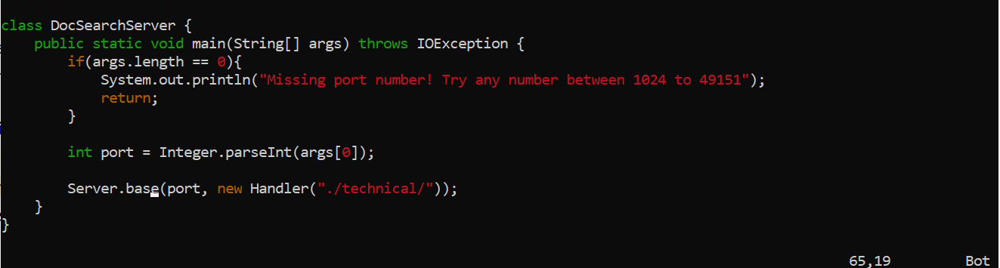
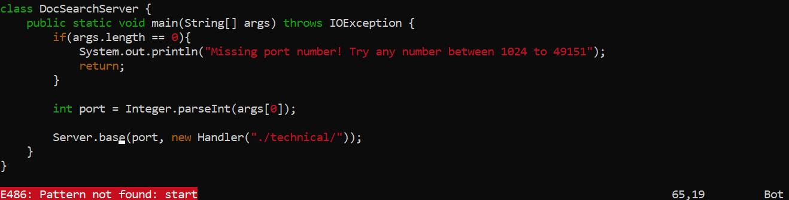

# Part 1

Task: Changing the name of the start parameter and its uses to base

## Sequence
```
/start <Enter> cgn base <esc> n . . .
```

**/start \<Enter>**


This series of keystrokes brings the cursor to the first occurence of the word "start"

**cgn**

Typing in cgn goes to the word that was last searched, here being start, highlights that word, deletes, and goes to insert mode



**base \<Esc>**

This sequence of keystrokes types in the word base, and reverts back to normal mode

**n . . .**

Pressing the n key goes to the next instance of the word last searched, in this case the next instance of "start". Pressing the dot character redoes the chain of commands, that is cgn base \<Esc> n, which deletes the current word, goes into insert mode, writes the word base, goes back to normal mode, and goes to the next instance of "start". Pressing the dot character 3 times allows me to replace the 3 remaining instances of "start" with "base".





Pressing n here again isn't part of the input chain since our task is complete so it was left out of the keystroke sequence above. However doing so verifies that there are no more instance of "start" to replace. 



# Part 2

**VSCode approach: 37.04 seconds**

The main difficulty of this approach came from making sure that the scp directory was correct. Though it wasn't bad for this case, it may be cumbersome replacing every variable by hand.

**Vim approach: 36.73s**

The main difficulty of this approach was typing in the exact sequence of keys to edit the file properly. Editing the file in vim did seem a lot smoother, however.


<br>

Despite how hard vim was shilled during lecture, I still prefer using the VSCode approach. Though this comparison may suggest Vim as efficient if not more efficient than VSCode, it took me over 5 minutes to look up the correct sequence of keys just for this simple operation. Having to learn enough about vim to make it have a noticeable impact on my development efficiency is simply not worth the time. The point I made about having it being cumbersome manually replacing variables is also made moot by the fact that many editors come with a refactor option to rename variables and classes. In fact, this may be better than even vim since it is less error prone as the scope may be controlled. It could be argued that scp is inefficient since you either have to copy over everything resulting in redundancy, or modify the copy path everytime. This can be resolved by simply setting up a github repository and using push and pull to make changes on the local and remote respectively. The only time I would consider learning vim is if I knew I had to work on a project that had access to only a terminal environment for an extended period of time, at least a month. In any other case, editing locally and pushing to the remote makes much more sense from a time investment perspective.  