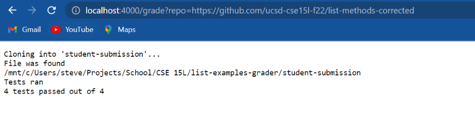
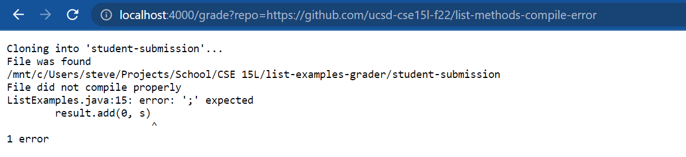
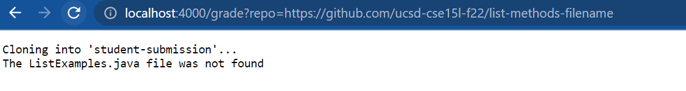

# Bash Script
```bash
# Create your grading script here

#set -e

rm -rf student-submission
git clone $1 student-submission

cp TestListExamples.java student-submission
cp Server.java student-submission
cp GradeServer.java student-submission


cp -r lib student-submission
cd student-submission

if [ -e ListExamples.java ]
then
    echo "File was found"
else
    echo "The ListExamples.java file was not found"
    exit 1
fi

classpath=".:lib/hamcrest-core-1.3.jar:lib/junit-4.13.2.jar"
pwd
javac -cp .:lib/hamcrest-core-1.3.jar:lib/junit-4.13.2.jar *.java 2> err.txt

if [ $? -eq 1 ]
then
    echo "File did not compile properly"
    cat err.txt
    exit 1
fi

java -cp .:lib/hamcrest-core-1.3.jar:lib/junit-4.13.2.jar org.junit.runner.JUnitCore TestListExamples 2> err.txt > out.txt

echo "Tests ran"

#cat err.txt

fails=$(head -n 2 out.txt | tail -n 1 | grep -o "E" | wc -l)
tests=$(head -n 2 out.txt | tail -n 1 | grep -o "\." | wc -l)

echo "$(($tests - $fails))" tests passed out of $tests
#cat out.txt

#java GradeServer 4000
exit
```
# Screenshots of Running Server







# Code trace for list-methods-filename

```bash


rm -rf student-submission
#No standard output, no standard error, student-submission successfully removed
git clone $1 student-submission
#No standard error
#Standard output: Cloning into 'student-submission'...


cp TestListExamples.java student-submission
#No standard output, no standard error
cp Server.java student-submission
#No standard output, no standard error
cp GradeServer.java student-submission
#No standard output, no standard error


cp -r lib student-submission
#No standard output, no standard error

cd student-submission
#No standard output, no standard error


#this if statement evaluates to false, since our example had an incorrectly named file
if [ -e ListExamples.java ]
then
#this line does not run, since the above condition evaluated to false
    echo "File was found"
else
    echo "The ListExamples.java file was not found"
    #Standard output is the above message, no standard error
    exit 1
    #exits with error code 1
fi

#No line after this point runs, since the file was not found and the grading script exits prematurely.

classpath=".:lib/hamcrest-core-1.3.jar:lib/junit-4.13.2.jar"
pwd
javac -cp .:lib/hamcrest-core-1.3.jar:lib/junit-4.13.2.jar *.java 2> err.txt

if [ $? -eq 1 ]
then
    echo "File did not compile properly"
    cat err.txt
    exit 1
fi

java -cp .:lib/hamcrest-core-1.3.jar:lib/junit-4.13.2.jar org.junit.runner.JUnitCore TestListExamples 2> err.txt > out.txt

echo "Tests ran"

#cat err.txt

fails=$(head -n 2 out.txt | tail -n 1 | grep -o "E" | wc -l)
tests=$(head -n 2 out.txt | tail -n 1 | grep -o "\." | wc -l)

echo "$(($tests - $fails))" tests passed out of $tests

exit
```